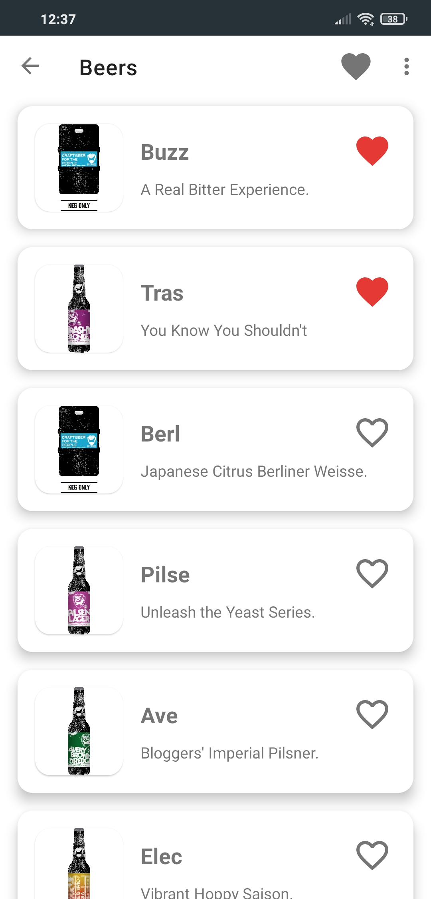
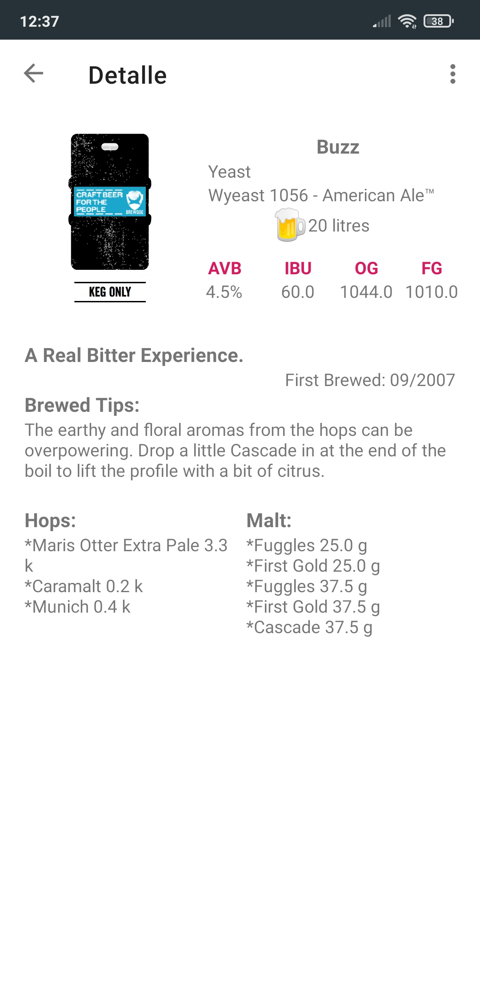
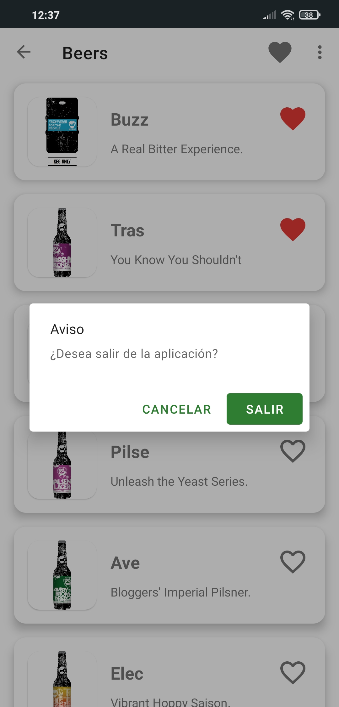

# Prueba Android

- Kotlin
- Coroutines
- MVVM
- Extension Functions
- Dagger Hilt
- Retrofit
- Room
- Navigation Components
- Cache Strategy (Repository Pattern)
- Picasso
- Facebook Shimmer
- Data Binding

# Pantallas
<table>
    <tr>
      <td> </td>
      <td> </td>
      <td> </td>
      <td> </td>
      <td> </td>
    </tr>
</table> 
